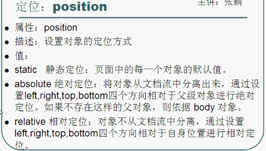

# CSS笔记

## CSS导入

写多个CSS文件，分别负责不同的部分。eg:font.css, color.css ...

然后写一个basic.css 在basic中导入这些样式

    import url("font.css");
    import url("color.css");

在index.html中直接link一个css文件就可以了~~~

## CSS控制文本对齐方式

vertical-align:可以设置元素的垂直对齐方式。其他值：middle,bottom...

line-height:设置行高，如果行高设置为height的高度，那么内部元素会垂直居中。可应用于输入框。

## CSS文字样式

## 可以使用!important提高样式的优先级。

    eg:color: red !important;

## CSS控制链接，鼠标移上、点击，移开...

注意：如果设置链接样式之后，点击过一次就不再起作用了 ---> 修改样式的顺序为L(点击之前)-V(访问之后)-H(鼠标放上)-A(点击的时候)。

**自定义链接样式：**

格式：
a:类名:状态名{样式...}

    a:web:visited {color:back}

### **其他伪类foscus**

可用于定义获取到焦点时的样式，如输入框.

    格式：selector:focus {样式}
    input:focus{
                background:gold;  
    }

## CSS选择符的使用

    /*给id为nav或者类为nav的标签使用的样式*/
    标签 #nav {...样式...} / 标签 .nav {...样式...}

    /*给标签1内部的标签2，nav标记的元素内部的标签使用的样式，有子父级关系*/
    标签p 标签span {...样式...} / #nav 标签{...样式...} / .nav 标签{...样式...}

    /*定义样式组*/
    div,h1,h2,h3,strong {
        font-weight:normal;
    }

## CSS盒子模型

主要部分：
* content
* border 边框
* padding 内边距
* margin 边界/外边距

注：使用margin时要注意浏览器的兼容性。

一般网站都会这样写，**清除浏览器的默认样式**：

    /*因为浏览器的默认样式不一样，导致一些标签的默认值不同，这样写清除了浏览器的默认样式。*/
    body,div,p,...,form {border:0, none;margin:0;paddinf:0}

## CSS控制边框属性

## 让盒子水平居中

将对象的左右的左右外边距margin设置为auto，也就是自动计算。

## 让盒子中的内容垂直居中

设置line-height为height的值,但不要有换行。

## 盒子模型中的元素分类

**块元素：**
独占一行，设置宽高是起作用的。eg:div,p,h1,li

**内联元素：**
只能容纳文本或者其他内联元素，允许其他内联元素与其位于同一行，但宽高设置是无效，它只会包裹内部元素大小。eg:span,a,em

## CSS控制背景

注：背景图片的依附方式，设置background-attachment(值：scroll,fixed).

分别表示固定了滚动，如果设置为固定，它表示固定在可视窗口的某个位置。
如果设置为scroll，那么背景图片的位置就是相对于元素元素位置来说的。

## CSS精灵技术

解释：用图片设置某个元素不同情景下的样式变化。准备一张/多张图片，在不同的情景下(4种伪类：link,hover,visited,active)
用background-image设置背景。

`如果是将多张图片组合在一张图片里，可以减少http请求次数，这时，使用background-position设置背景图的位置，
来控制显示哪个图片。`

注：如果使用内联元素，如a,span时，由于无法设置宽高，会导致背景图片显示不出来，将其设置为**块元素**。

---

## CSS布局的三种方式

1. 文档流方式
2. 浮动布局方式 float
3. 定位布局方式 (使用position+top+left...属性进行设置)

### 浮动

**原理：**
取消块元素独占一行的行为，允许别的元素和它在同一行。
浮动其实是将这个元素从原来的文档流模式中分离出来，这样一来它
之后的元素对象就视它不存在了。

**使用技巧：**
如果想让多个块显示在同一行，可以给这些块都设置为浮动，
并且让它们向一个方向浮动。

### 清除浮动

去掉前面对象浮动，对后面对象的影响。
也就是说，前面对象浮动之后留下来位置，后面对象不会去占用。

使用方法：clear:none/left/right/both 
清除前边对象左右浮动对我的影响。

解释：清除前面左/右/两边浮动的元素对我的影响(也就是说放在放在被影响的元素上)。
这样即使前面有元素浮动了，也会保留它们的位置。

### 技巧

设置一个块水平居中时，都会给这个块设置一个宽度值。因为如果不设置宽度，那么这个块就默认占满整个
屏幕，感觉不出来是否水平居中。

**浮动之后水平居中就没用了，应该怎么办：**
给浮动的快外面加大盒子，让大盒子水平居中，这样就浮动的块也可以水平中居中了。

**浮动对父元素的影响：**
当父元素没用指定高度时，它的子元素有浮动，这个父元素的高度不会自动增加。

**解决方法：**
1. 额外标签：在父元素末尾加上一个额外的空标签，要求这个标签设置`clear:both;`

        

                
左

                
右

                

<!--增加一个空的div-->
            

2. 给父元素加`overflow:hidden;`,缺点，如果子元素使用了定位布局，就会很难实现。

    ### 定位布局

    可以通过元素的position属性控制元素的位置。

    

    **要使用绝对定位的两个条件：**
    1. 必须给父元素设置定位属性，一般是`positive:relative;`
    2. 必须给子元素加绝对定位`positive:absolute;`,同时要加方向属性。

    **相对定位和绝对定位的区别：**
    1. 绝对定位是以父元素为基准点，进行定位，它会使得标签元素脱离文档流。
    2. 相对定位是以原位置为基准点，进行定位，标签元素离开原来的位置，但是还保留所占位置。

3. 使用伪对象`after`方法

    原理其实和第一种方法类似，因为after就是在对象后面加内容。按照下面的方法定义`clearFix`这个类，
    然后给`父元素`使用就可以了。

    
